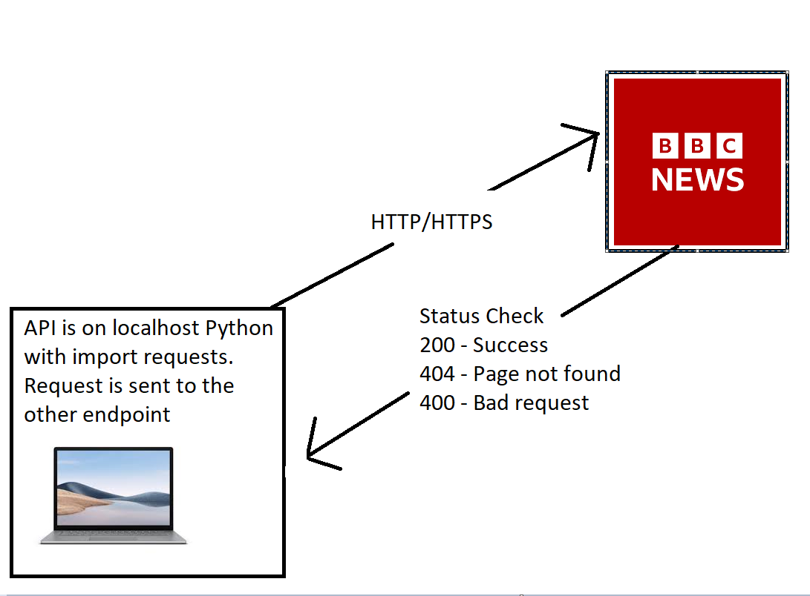
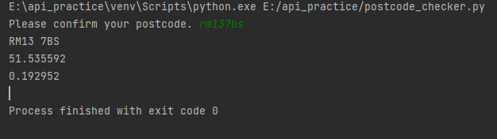

# Python Practice

```python
def user_name():
    pass

def loop_array():
    arr = [1,2,3,4,5]
    for item in arr:
        print(item)

# you can use boolean operators: | or, & and, not. &&, || determine if something is 'truthy or falsy'

# lists are mutable, tuples are immutable

# you can't add elements to tuples as they are immutable

# you can have multiple types of data in a tuple

# data type is a dictionary

class DevOps:
    pass
object_ = DevOps()

def append_(arr= [1,2,3,4]):
    arr.append(5)
    return arr

def arguments(arg):
    if arg == "devops":
        return True
    return False

class ClassZ:
    pass

class ClassY(ClassZ):
    def __init__(self):
        super().__init__()

def odd_even(lst, value):
    for i in range(len(lst)):
        if lst[i] == value:
            if (i + 1) % 2 == 0:
                return True
            else:
                return False
        else:
            return None


def percentage(value1,value2):
    if value1 | value2 == 0:
        v_1 = int(input("Enter a new number. "))
        v_2 = int(input("Enter a new number. "))
        percentage(v_1,v_2)
    return 100 * value1 / value2

def divide(value1,value2):
    if value1 | value2 == 0:
        v_1 = int(input("Enter a new number. "))
        v_2 = int(input("Enter a new number. "))
        divide(v_1,v_2)
    return value1/value2

def dob(day, month):
    if day < 1:
        v_1 = int(input("Enter a day. "))
        v_2 = int(input("Enter a month. "))
        day, month = dob(v_1, v_2)
    return day, month

print(dob(0,12))

def multiply(value1, value2):
    if value1 | value2 == 0:
        v_1 = int(input("Enter a new number. "))
        v_2 = int(input("Enter a new number. "))
        multiply(v_1,v_2)

    return value1 * value2

def find_odd_even(lst):
    """finds locations of odd and even numbers in a list"""
    even_lst = []
    odd_lst = []
    for i in range(len(lst)):
        if lst[i] % 2 == 0:
            even_lst.append(i)
        else:
            odd_lst.append(i)
    return even_lst, odd_lst

def bill():
    shopping_lst = {
        "milk": 3.4,
        "potato": 5.5,
        "bread": 6,
        "butter": 7,
        "cookies": 5.4
    }
    total = 0
    for key, value in shopping_lst.items():
        total += value
    return total

```

# API
## Python API

### What is an API?
Application Programming Interface. They are used to talk to any foreign server so we can gather
information from them
### Benefits of an API
- API saves a lot of time.
- Ease of integration
- Automating tasks



### Python requests
```python
import requests
from bs4 import BeautifulSoup

r = requests.get("https://www.bbc.co.uk/iplayer/live/bbnews")

print(f"The status code is {r.status_code}.")
# should give us status code only

if r.status_code in range(200, 299):
    print(f"The server is live. Status code: {r.status_code}")
    contents = r.content.decode("utf-8")  # get the content from the web-app endpoint
    print(r.headers.values())
    soup = BeautifulSoup(contents)
    print(soup.prettify())
else:
    print(f"The server is not live. Status code: {r.status_code}")
```
### Alternate method
```python
if r:  # what is it checking?
    print("Success")
elif r == 404:  #
    print("Unsuccessful")
else:
    print(f"Oops! Status code: {r.status_code}")
```
### Alternate method #2
```python
def status_code_check(url):
    r = requests.get(url)
    if r:
        return f"The server is live. Status code: {r.status_code}"
    return f"The server is unavailable. Status code: {r.status_code}"
```
### Postcode checker
```python
class PostcodeChecker:
    def __init__(self, postcode):
        base_url = "http://api.postcodes.io/postcodes/"
        self.postcode = postcode
        self.url = base_url + self.postcode
        r = requests.get(self.url)
        self.data = r.json()
        self.confirm_postcode()

    def confirm_postcode(self):
        user_input = input("Please confirm your postcode. ").lower()
        if user_input != self.postcode:
            print("That was the incorrect postcode")


    def get_postcode(self):
        for key in self.data["result"].keys():
            if key == "postcode":
                return self.data["result"][key]

    def get_latitude(self):
        for key in self.data["result"].keys():
            if key == "latitude":
                return self.data["result"][key]

    def get_longitude(self):
        for key in self.data["result"].keys():
            if key == "longitude":
                return self.data["result"][key]
```

```python
from post_code_api import PostcodeChecker

postcode = PostcodeChecker("rm137bs")
print(postcode.get_postcode())
print(postcode.get_latitude())
print(postcode.get_longitude())
```


### America Weather Alerts by State
```python
import requests
import json


class WeatherAmerica:
    def __init__(self, state):
        self.state = state.upper()

    def different_states(self):
        """Lists the abbreviations for the different states"""
        pass

    def get_data(self):
        """Retrieves weather information from """
        headers = {"User-Agent":
        "learningapirequests, sam.dennis0000@gmail.com"}

        r = requests.get(f"https://api.weather.gov/alerts/active?area={self.state}", headers=headers)
        data = json.loads(r.content)
        with open(f"weather_{self.state}.json","w") as f:
            json.dump(data, f)


    def read_data(self):
        with open(f"weather_{self.state}.json","r") as f:
            data = json.loads(f.read())
        return data


current = WeatherAmerica("CA")
current.get_data()
```